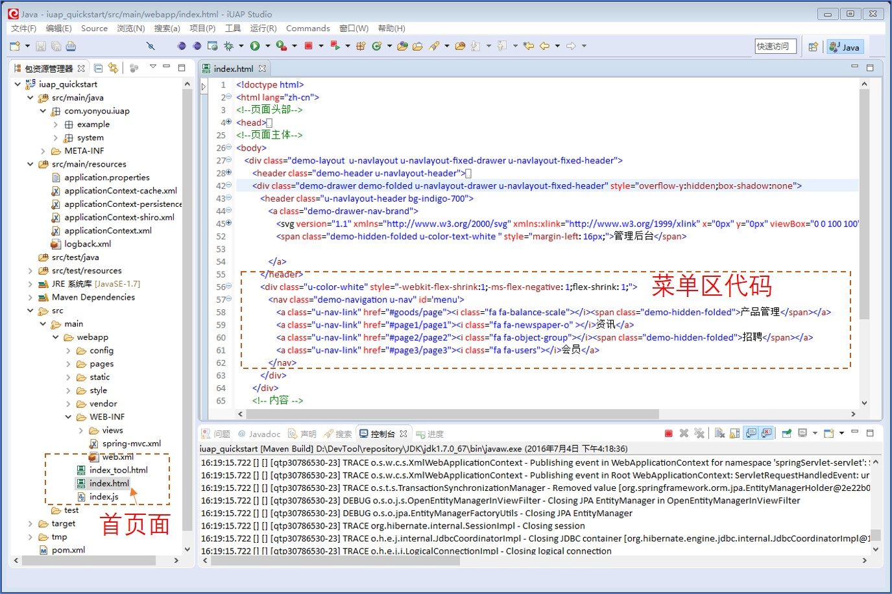

## 前端配置简介


### 主界面说明

产品界面如下图，由左侧是菜单区，右侧是功能内容区，最上部是系统功能导航区三部分组成。


首页中定义菜单位置如下：  

```
<div class="u-color-white" style="-webkit-flex-shrink:1;-ms-flex-negative: 1;flex-shrink: 1;">
     <nav class="demo-navigation u-nav" id='menu'>	
		<a class="u-nav-link" href="#goods/page"><i class="fa fa-balance-scale"></i><span class="demo-hidden-folded">产品管理</span></a>
		<a class="u-nav-link" href="#page1/page1"><i class="fa fa-newspaper-o" ></i>资讯</a>
		<a class="u-nav-link" href="#page2/page2"><i class="fa fa-object-group"></i><span class="demo-hidden-folded">招聘</span></a>
        <a class="u-nav-link" href="#page3/page3"><i class="fa fa-users"></i>会员</a>
      </nav>
</div>
```

主页面在`index.html`文件中,并且在底部引入了`require.js`和首页对应的初始化js文件。


 

```
    <script type="text/javascript" src="vendor/requirejs/require.js"></script>
    <script type="text/javascript" src="config/require.config.js"></script>
    <script type="text/javascript" src="index.js"></script>
```
`require.config.js`中定义了对三方技术框架的引入。  


示例在`index.js`中初始化了菜单，用户点击对应的菜单时，路由到了对应的模块的js中，如果`pages/page.js`.  
`page.js`中指定了需要加载的模块html片段，代码如下：  
	
	define(['jquery', 'knockout', 'text!pages/goods/page.html', 'uui'], function($, ko, template)  

模块中会执行init方法，触发功能的后续步骤，如从后台获取数据，渲染界面等。在模块的js文件中，定义前端数据模型，编写前后端交互代码完成前端开发。  
此文档只简要说明代码位置及意义，具体的前端开发过程和控件使用方法，请参考官网的前端组件对应的技术文档。  